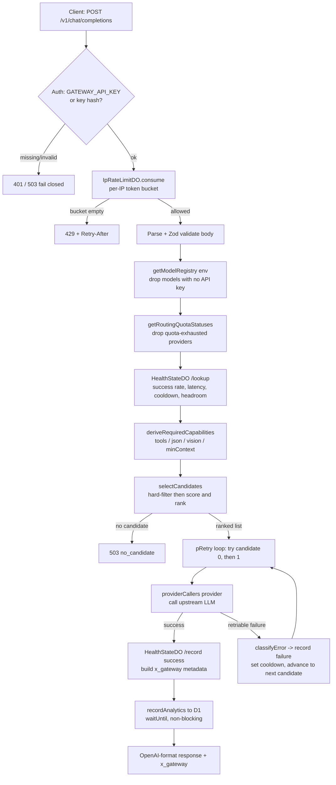

# How free-ai works: end-to-end

This is a pedagogical walkthrough of the gateway for someone reading the code for
the first time. It explains the moving parts, follows one request all the way
through, and — most importantly — the *why* behind the design choices.

If you already know the shape and want the terse rationale, read
[`overview.md`](overview.md) and the [ADRs](decisions/adr-001-007.md) instead;
this page links to them rather than repeating them.

## The one-sentence version

free-ai is a single Cloudflare Worker that speaks the OpenAI API, but instead of
one backend it fans requests across 11 free-tier LLM providers (80+ chat models
in [`src/config.ts`](../../src/config.ts)), picking the healthiest capable model
for each call and falling back automatically when one throttles. Fleet projects
call it as their "OpenAI" so nobody pays per-token for routine work.

## The components

Everything runs inside one Worker (`src/index.ts`, a deliberately monolithic Hono
app — see [ADR-003](decisions/adr-001-007.md)). The pieces it coordinates:

| Component | File | Job |
| --- | --- | --- |
| **Model registry** | [`src/config.ts`](../../src/config.ts) | Static list of every model + its provider, reasoning tier, capabilities, priority. Filtered down to what is actually usable per request. |
| **Provider callers** | [`src/providers/`](../../src/providers/) | One adapter per provider (`groq.ts`, `gemini.ts`, `cerebras.ts`, …). `providerCallers` in `providers/index.ts` maps a provider name to its call function. |
| **Router** | [`src/router/select-model.ts`](../../src/router/select-model.ts) | Turns the registry + live health into a *ranked, hard-filtered* candidate list. |
| **Eval weights** | [`src/router/evaluation-weights.ts`](../../src/router/evaluation-weights.ts) | Optional quality nudge applied on top of the health score. |
| **Error classifier** | [`src/router/classify-error.ts`](../../src/router/classify-error.ts) | Maps an upstream failure to `usage_retriable` / `input_nonretriable` / `safety_refusal` / `provider_fatal`. |
| **Health state** | [`src/state/health-do.ts`](../../src/state/health-do.ts) | `HealthStateDO` — one global Durable Object tracking per-model success rate, latency, cooldown, and daily usage. |
| **Rate limiter** | [`src/state/ip-rate-limit-do.ts`](../../src/state/ip-rate-limit-do.ts) | `IpRateLimitDO` — one DO per client IP, a token bucket. |
| **Neuron budget** | [`src/state/neuron-budget-do.ts`](../../src/state/neuron-budget-do.ts) | `NeuronBudgetDO` — caps Workers AI spend at 9,500 neurons/day. |
| **State client** | [`src/state/client.ts`](../../src/state/client.ts) | The typed RPC-over-`fetch` helpers the Worker uses to talk to those DOs. |
| **Analytics** | D1 (`GATEWAY_DB`) | Per-project request counts, written fire-and-forget. |

Bindings are declared in [`wrangler.toml`](../../wrangler.toml): `AI` (Workers AI),
`HEALTH_KV`, the three Durable Object classes, and `GATEWAY_DB` (D1).

## Following one request

Here is a `POST /v1/chat/completions` from the moment it hits the Worker to the
response. Line references are into `src/index.ts` unless noted.



### 1. Auth (fail closed)

The `/v1/*` middleware (`index.ts:728`) first checks a small read-only allowlist
(`/v1/models`, `/v1/analytics`, `/health`, …) that needs no key. Everything that
spends tokens requires a valid `GATEWAY_API_KEY` or a hashed key from
`GATEWAY_API_KEY_HASHES`. If **no** auth secret is configured at all it returns
`503` — a misconfigured deploy must not silently become a public, free LLM proxy.
An invalid key returns `401`. *Why:* the failure mode of "open by accident" is
expensive, so the code fails closed. See the auth model in
[`overview.md`](overview.md#auth-model).

### 2. Per-IP rate limit

`consumeIpRateLimit` (`state/client.ts:111`) routes to an `IpRateLimitDO` keyed by
`cf-connecting-ip`. Each DO is a token bucket: it refills at `refillPerSecond`,
each request costs one token, and an empty bucket returns `429` with a computed
`Retry-After`. A 24h inactivity alarm deletes the DO so idle IPs cost nothing.
*Why a DO and not KV:* the bucket read-modify-write must be atomic per IP; KV has
no compare-and-swap, so concurrent requests would race and over-admit.

### 3. Build the usable registry

`getModelRegistry(env)` (`config.ts:1679`) starts from the static model list and
drops any model whose provider has no API key present in `env`
(`hasProviderKey`). Then `getRoutingQuotaStatuses` drops providers already known
to be quota-exhausted (`index.ts:1312`). *Why:* the registry is static, but which
slice is *live* depends entirely on which free keys this deployment happens to
hold — so the usable set is computed fresh per request from the environment.

### 4. Read live health

`healthLookup` (`state/client.ts:8`) asks the single global `HealthStateDO`
(`idFromName('global-health')`) for a snapshot of every candidate key: success
rate over its last-100-attempt ring, average/p90/p99 latency, `cooldownUntil`, and
`headroom` (`1 - dailyUsed / dailyLimit`). *Why one global DO:* health is a
cross-request signal — a 429 seen on request A must inform request B milliseconds
later. Splitting per provider would need a key-routing layer; at current traffic
one instance is fine ([ADR-001](decisions/adr-001-007.md), [ADR-007](decisions/adr-001-007.md)).

### 5. Derive required capabilities (the hard filter)

`deriveRequiredCapabilities` (`select-model.ts:75`) inspects the request *before*
scoring and produces non-negotiable requirements: a `tools` array demands
`toolCalling`, `response_format: json_object` demands `jsonMode`, an `image_url`
part demands `vision`, and message size sets `minContextWindow` (chars ÷ 4, +20%
output buffer). *Why up front:* routing to a model that structurally cannot handle
the request would 400 at the provider and burn a health record for nothing —
better to filter it out and, if nothing qualifies, return `503`
([ADR-005](decisions/adr-001-007.md)).

### 6. Select and rank candidates

`selectCandidates` (`select-model.ts:161`) does two passes:

1. **Hard filter** — remove anything that fails streaming support, the requested
   `min_reasoning_level`, a capability requirement, an in-effect cooldown
   (`cooldownUntil > now`), or exhausted `headroom <= 0`.
2. **Score + sort** — `computeScore` (`select-model.ts:114`) blends the survivors:

```
coreScore = successRate·0.6 + headroom·0.2 + latencyScore·0.15
          + reasoningFit·0.05 + priority·0.02
finalScore = coreScore · evaluationWeight     # eval clamped to [0.8, 1.2]
```

`successRate` dominates on purpose: on the free tier, *reliability* varies far
more than raw quality, so a fast model that 429s half the time should lose to a
slower one that answers. The eval multiplier (`evaluation-weights.ts`) can only
*nudge* within `[0.8, 1.2]` — it can never resurrect an unhealthy or incapable
model. Full rationale in [ADR-002](decisions/adr-001-007.md).

**Workers AI sorts last, always.** `fallbackRank` (`select-model.ts:153`) returns
`1` for `workers_ai` and `0` for everyone else, and that comparison wins the sort
ahead of score. *Why:* every external provider is free to the gateway, but Workers
AI Neurons are a billed Cloudflare resource. It is a safety net, not a peer —
never move it up ([overview.md](overview.md#workers-ai-is-intentionally-last)).

When the caller asked for `auto` (no specific model), a round-robin offset from the
DO rotates the top candidates so load spreads instead of hammering the #1 model.

### 7. Try, fall back, record

The `pRetry` loop (`index.ts:1437`) walks the ranked list, **capped at two
attempts**. It calls `providerCallers[candidate.provider]` with the normalized
OpenAI payload. On success it calls `healthRecord(success)` and stamps the
response with `x_gateway: { provider, model, attempts, reasoning_effort,
request_id }`. On failure, `classifyError` (`classify-error.ts:37`) decides what
happened:

- `usage_retriable` (429/408/5xx, rate-limit/timeout text) → record the failure,
  which sets a cooldown in the DO, then advance to the next candidate.
- `input_nonretriable` / `safety_refusal` / `provider_fatal` → these are logged
  into the health ring too, feeding the failure breakdown in provider stats.

*Why the retry loop is the whole point:* a single 429 from Groq should never fail a
user's request. The loop makes an unreliable patchwork of free tiers behave like
one dependable endpoint — and each failure teaches the router (via the cooldown +
success-rate it records) to avoid that model for a while.

Recording into `HealthStateDO` also debounces a snapshot into `HEALTH_KV` (30s
alarm, 5-min TTL) so the dashboard and `/v1/stats/providers` can read health
without hitting the DO on every request ([ADR-007](decisions/adr-001-007.md)).

### 8. Analytics (never on the critical path)

`recordAnalytics` (`index.ts:1070`) upserts a per-`project_id`/day/provider/model
row into the D1 `GATEWAY_DB`, scheduled via `executionCtx.waitUntil` so it runs
*after* the response is sent and its errors are swallowed. *Why:* analytics is
observability, not correctness — it must never slow down or fail a completion.
`project_id` is required on mutation routes precisely because every analytics row
is keyed by it.

## How fleet projects consume it

Other fleet projects (e.g. ai-game) don't hit the public URL — they add a
**service binding** to this Worker and call it in-process. *Why:* a service
binding is a same-datacenter, zero-egress, zero-latency-tax call with no public
key to leak, so a fleet project gets "OpenAI-compatible" LLM access with none of
the cost. The public custom domain (`ai-gateway.sassmaker.com`) exists mainly for
the docs site and external clients.

## The design decisions in one place

Every "why" above traces to a durable decision:

- **Health-aware routing** — free tiers are individually unreliable; routing on
  observed success rate turns them into a collectively reliable service.
- **Free-first, Workers AI last** — external free tiers cost the gateway nothing;
  billed Neurons are the fallback of last resort, hard-capped.
- **Service bindings for fleet consumers** — free, private, low-latency LLM access
  for sibling projects.
- **Fail closed on auth, fire-and-forget on analytics** — protect the expensive
  failure mode (accidental open proxy); never let cheap observability block a call.

For the recorded, dated versions with alternatives considered, read the
[ADRs](decisions/adr-001-007.md). For the current live state and blockers, see
[`../../STATUS.md`](../../STATUS.md).
